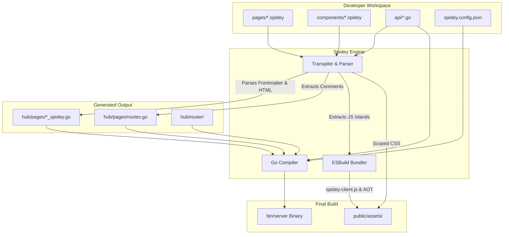
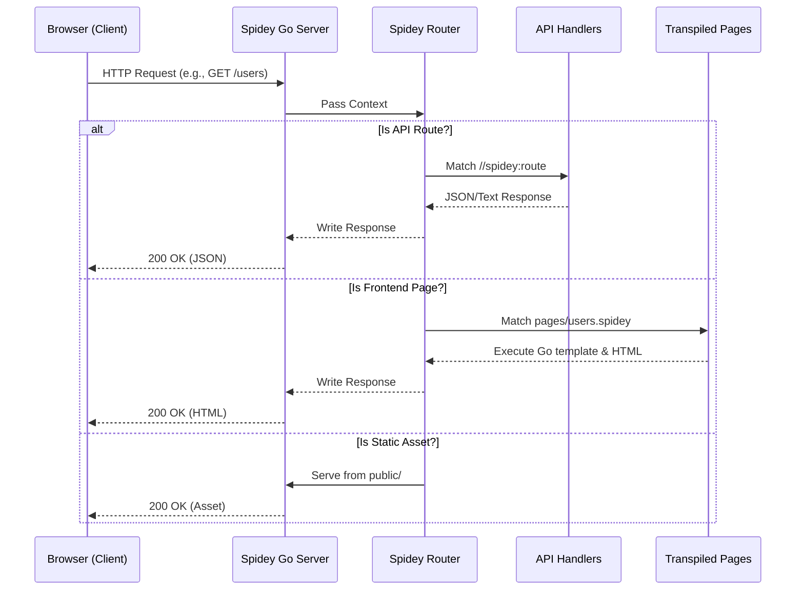

# Architecture

Spidey operates by compiling a unique combination of frontend templates and backend Go logic into a single, high-performance binary.

## System Overview

## Routing and Request Lifecycle

Spidey uses a powerful custom router to handle both static frontend views and backend API routes concurrently.

### How Routes Work

When you build or run the development server, Spidey analyzes your project to generate a unified routing table:

1. **Frontend Routes (`pages/`)**: 
   Every `.spidey` file is compiled into a Go function. If you have a file at `pages/about.spidey`, the engine writes a Go router registration mapping `GET /about` to that template.
2. **Backend Routes (`api/`)**:
   Spidey scans your Go files for magic comments like `//spidey:route GET /api/data`. It extracts the method, path, and handler function, injecting them into the generated `hub/pages/routes.go`.
3. **Dynamic Parameters**:
   Bracket syntax like `[id]` in filenames (e.g. `pages/users/[id].spidey`) or API comments is converted into regex-based parameters (e.g., `{$id}`) under the hood.

## Transpilation Details

When you build or run dev, the Spidey engine (`internal/bundler` and `internal/parser`) scans your project:

1. **Pages (`.spidey`)**: Transpiled into `hub/pages/` as Go files utilizing `html/template`. Frontmatter is extracted and injected as Go structs/logic.
2. **CSS**: `<style>` and `<style module>` blocks are parsed. CSS is scoped via AST-like parsing and extracted into a global `public/assets/spidey.css`.
3. **AOT JavaScript**: Inline `@events` are converted into vanilla JavaScript listeners and bundled into `spidey-aot.js`.
4. **API Routes**: Magic comments in `api/*.go` are regex-parsed to generate `hub/pages/routes.go`.

## Dev Watcher

`internal/dev/watcher.go` uses `fsnotify` to monitor changes. When a `.spidey` file changes, Spidey selectively re-transpiles the templates, rebuilds the Go binary, restarts the server process, and pushes a Server-Sent Event (SSE) to the browser for live reload.

## Hub Directory

The `hub/` directory is generated entirely by Spidey and should be ignored in source control. It contains:
- The `router/` package (copied from templates).
- The transpiled Go templates and auto-generated route registration functions.
